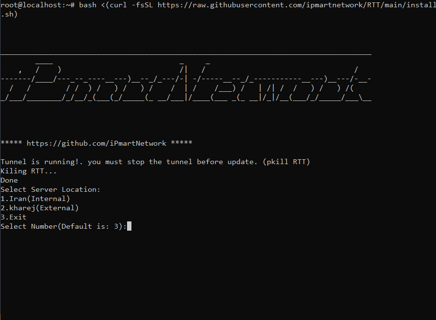

<p align="center">
  <a href="https://github.com/azavaxhuman/ipmart-tunnel">
    
  </a>
</p>
# RTT
# Reverse tls tunnel  
سیستم عامل پیشنهادی : ubuntu 20 , ubuntu 22 

یکی از بهترین روشهای تانل بین دو سرور ایران و خارج 

روش تونل کردن  Reverse Tls Tunnel هست

در این روش شما میتونید از پرتوکل های مختلف استفاده کنید. 
 

برای نصب دسترسی روت حتما نیاز است . اگر یوزری بجز روت دارید تایپ کنید sudo -i

یک سرور ایران رو میتونید به چند سرور خارج متصل کنید و حتی برعکس


## Install 

Easy installation

```bash
bash <(curl -fsSL https://raw.githubusercontent.com/ipmartnetwork/RTT/main/install.sh)
```

### How to Manage مدیریت سرویس
Stop the service.
```bash
systemctl stop tunnel.service
```
View the status of the service.
```bash
systemctl status tunnel.service
```
Restart the service.
```bash
systemctl restart tunnel.service
```

## Related

با تشکر از

https://github.com/radkesvat/ReverseTlsTunnel/tree/master

https://github.com/azadrahorg/RTT-Tunnel-Helper/tree/main 
